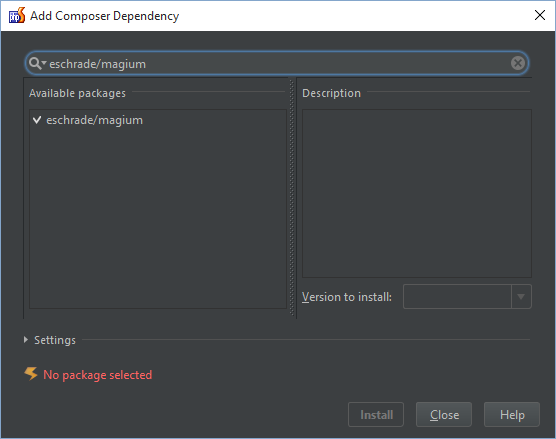
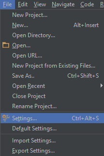
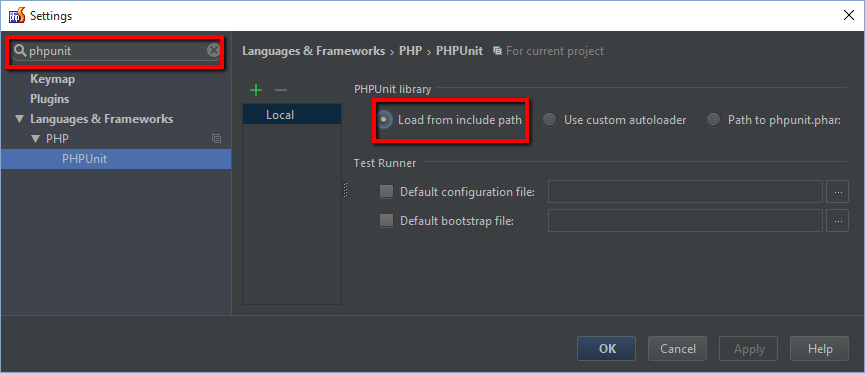
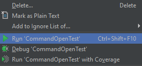

Getting Started with PHPStorm
=============================

Getting Magium to work with PHPStorm is pretty easy.

* Create a new project in PHPStorm
* Init Composer
* Add eschrade/magium as a dependency

* Go to settings

* Set PHPUnit to the include path (defined by the Composer setup)

Once you have done that you should be able to create your own tests and run it from PHPStorm.

